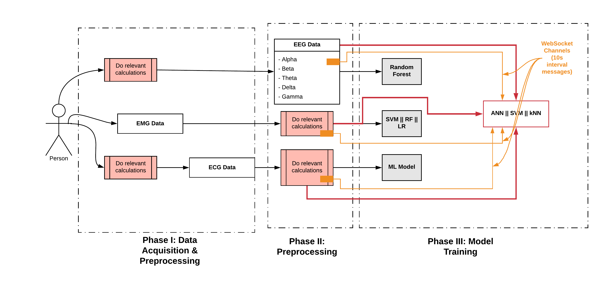

# Multimodal Drowsiness Detection using EEG, EMG, ECG

This repository contains the dataset, procedure and results of our model.

<div align="center">
    
</div> 

## Setting Up

WRITE THE SETTING UP SECTION HERE.

## API Endpoints

``curl -d '{"data":"[100, 200, 300]"}' -H "Content-Type: application/json" -X POST http://192.168.8.101:5000/predict``

### Data Endpoints

```python
import requests

url = 'https://<HOST>:5000/<MODALITY_TYPE>/data'
myobj = {'<MODALITY_TYPE>': '<values in an array>'}

x = requests.post(url, data = myobj)
```

For an example, consider the request below.

```python
import requests

url = 'https://192.168.8.100:5000/eeg/data'
myobj = {'eeg': '[10, 20, 30, 40, 50]'}

x = requests.post(url, data = myobj)
```

## References 

WRITE THE REFERENCE SECTION HERE.